# Lead 4: Node Sign-Entropy Heterogeneity vs. AUC (canonical, shared edges)

## Methodology

For each shared test edge `(u, v)`, bin source-node sign-entropy x
target-node sign-entropy into a 2D grid and compute AUC within each cell,
for 4 models: `walk_full` (E14_HARDNODE_L10, full attention),
`walk_localattn4` (E14_HARDNODE_L10_LOCALATTN4, +-2 hop banded attention),
`GINEConv`, `SiGAT`.

**Same-edge ground truth.** Per-edge predictions are read from
`predictions_raw_canonical.pkl` (built by `baselines/postprocess_canonical.py`
after the canonical-split baseline reruns); every model lives in the same raw
`(u, v)` id space. We restrict all models to the **shared edge set** (the
intersection of `(u, v)`, which equals the walk-covered test edges -- walk is
a strict subset of the GNN test sets). So every cell compares the four models
on the *identical* edges with the *identical* ground truth, and the per-cell
sample count `n` is the **same for all four models**. (This is the fix for the
old version, which bucketed each model over its own ~independent test sample;
see CANONICAL_RERUN_FINDINGS.md.)

**Entropy** is binary Shannon entropy in bits over a node's sign labels,
`H(p) = -p*log2(p) - (1-p)*log2(1-p)`, `p` = fraction of positive-sign edges in
the relevant direction. `H=0` -> homogeneous, `H=1` -> maximally heterogeneous.
Computed over **all edges** of the dataset (train+val+test) from the canonical
edge list -- a diagnostic grouping of already-trained models' predictions, not a
training-time feature, so no leakage. Nodes with zero edges in the relevant
direction are dropped.

**Entropy variants** -- source/target entropy from out-edges, in-edges, or
in+out (combined) signs of that node:

| variant | source | target |
|---|---|---|
| `out_out` | H(out-signs of u) | H(out-signs of v) |
| `in_in` | H(in-signs of u) | H(in-signs of v) |
| `out_in` | H(out-signs of u) | H(in-signs of v) |
| `inout_inout` | H(all incident signs of u) | H(all incident signs of v) |

**No retraining / recomputation here**: predictions are read straight from the
canonical pkl (walk-model func_logit_power aggregation, GINEConv saved
predictions, and the SiGAT logistic read-out all happened upstream). This
script only intersects edges, computes entropy, bins, and plots.

Gray cells (`n=.. (<min_n)` / `n=.. (1 class)` / empty) have no defined AUC.
Raw per-cell numbers are also dumped to `raw_data.txt`. Per-edge records
`(src_ent, tgt_ent, y, p)` are cached in `computed_data.pkl` for re-binning via
`--mode plot`.

## Results

### bitcoin-alpha

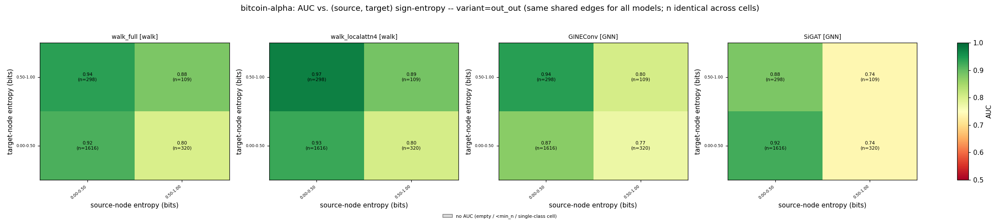

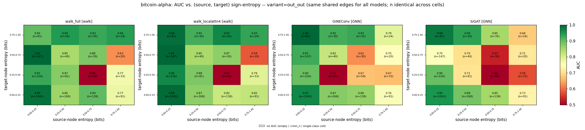

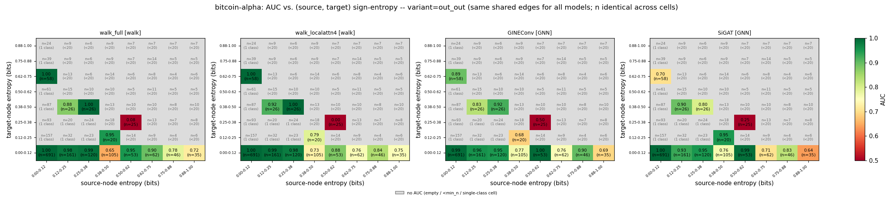

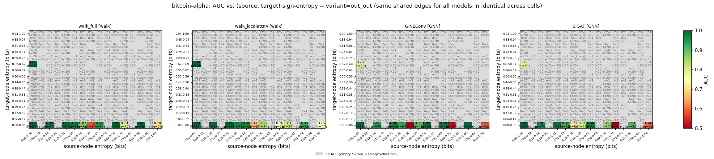

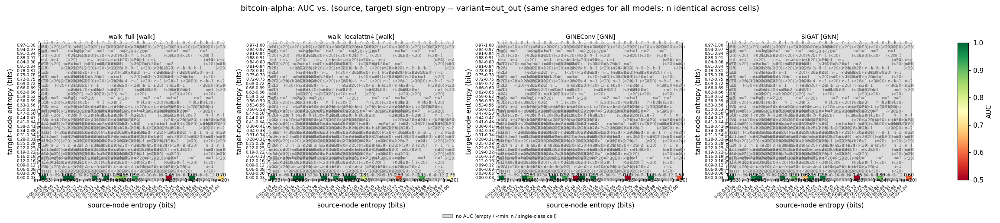

**variant = `out_out`**

| model | low-entropy AUC (n) | high-entropy AUC (n) | drop (low - high) |
|---|---|---|---|
| walk_full | 0.9169 (n=1616) | 0.8813 (n=109) | +0.0356 |
| walk_localattn4 | 0.9278 (n=1616) | 0.8868 (n=109) | +0.0410 |
| GINEConv | 0.8725 (n=1616) | 0.8037 (n=109) | +0.0689 |
| SiGAT | 0.9232 (n=1616) | 0.7370 (n=109) | +0.1862 |

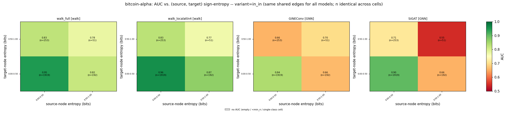

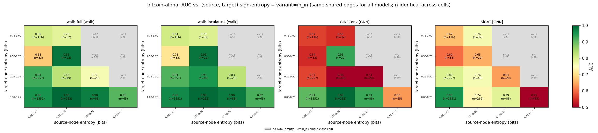

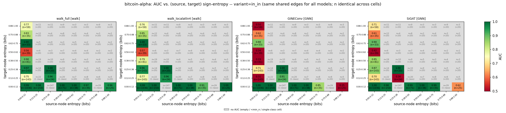

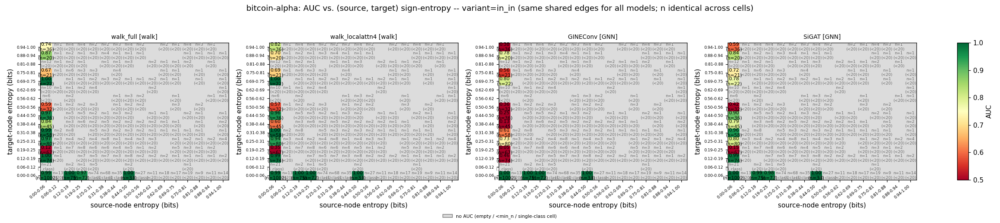

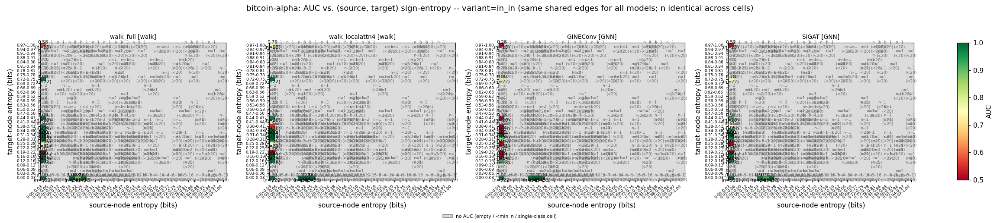

**variant = `in_in`**

| model | low-entropy AUC (n) | high-entropy AUC (n) | drop (low - high) |
|---|---|---|---|
| walk_full | 0.9456 (n=1919) | 0.7762 (n=51) | +0.1694 |
| walk_localattn4 | 0.9586 (n=1919) | 0.7685 (n=51) | +0.1901 |
| GINEConv | 0.8415 (n=1919) | 0.6975 (n=51) | +0.1440 |
| SiGAT | 0.9024 (n=1919) | 0.5463 (n=51) | +0.3561 |

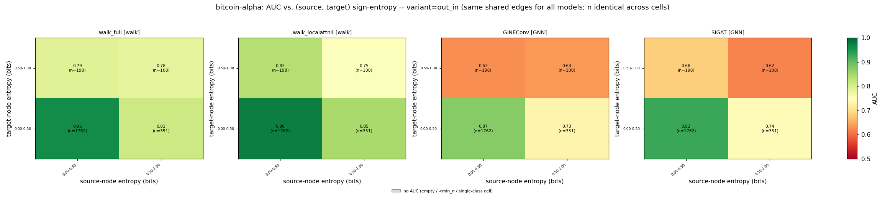

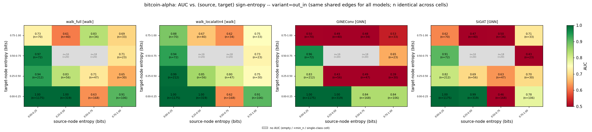

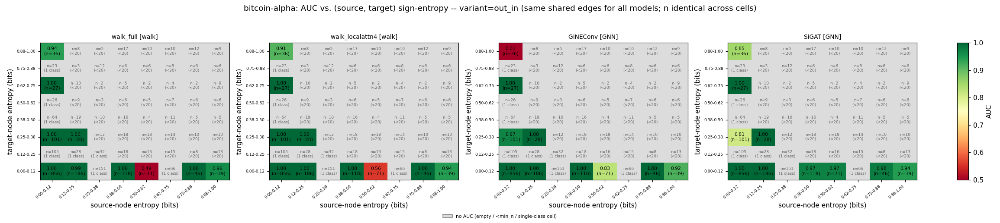

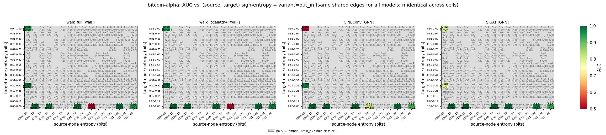

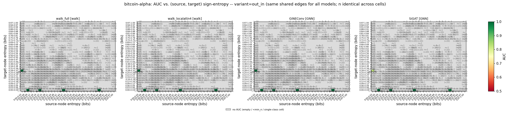

**variant = `out_in`**

| model | low-entropy AUC (n) | high-entropy AUC (n) | drop (low - high) |
|---|---|---|---|
| walk_full | 0.9610 (n=1762) | 0.7825 (n=108) | +0.1785 |
| walk_localattn4 | 0.9761 (n=1762) | 0.7525 (n=108) | +0.2236 |
| GINEConv | 0.8731 (n=1762) | 0.6338 (n=108) | +0.2393 |
| SiGAT | 0.9280 (n=1762) | 0.6190 (n=108) | +0.3090 |

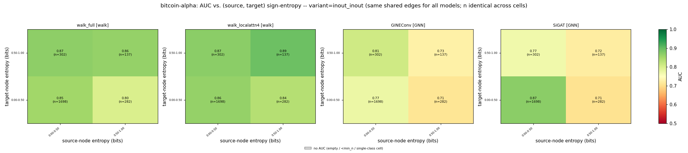

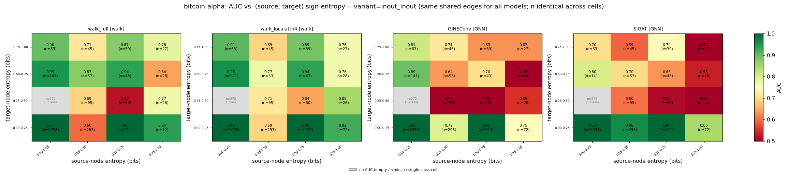

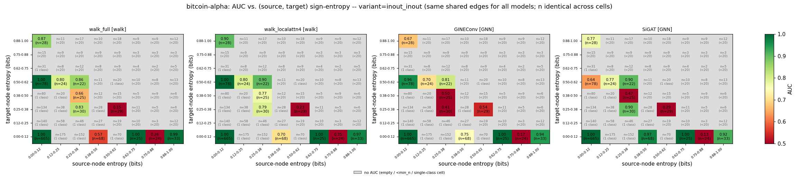

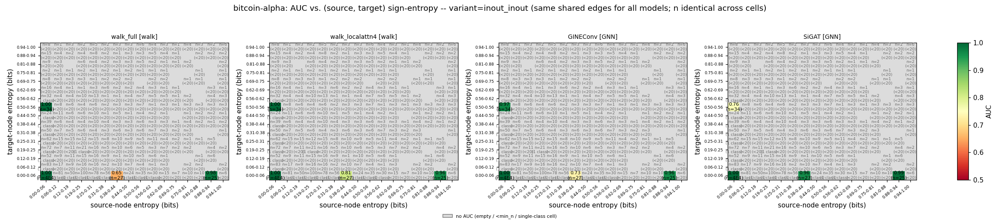

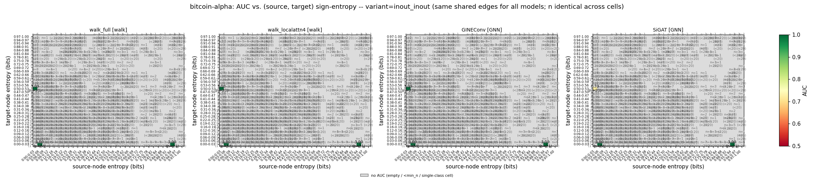

**variant = `inout_inout`**

| model | low-entropy AUC (n) | high-entropy AUC (n) | drop (low - high) |
|---|---|---|---|
| walk_full | 0.8535 (n=1698) | 0.8631 (n=137) | -0.0097 |
| walk_localattn4 | 0.8628 (n=1698) | 0.8934 (n=137) | -0.0306 |
| GINEConv | 0.7740 (n=1698) | 0.7267 (n=137) | +0.0473 |
| SiGAT | 0.8695 (n=1698) | 0.7209 (n=137) | +0.1485 |

### bitcoin-otc

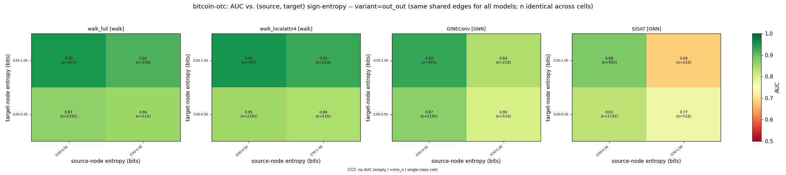

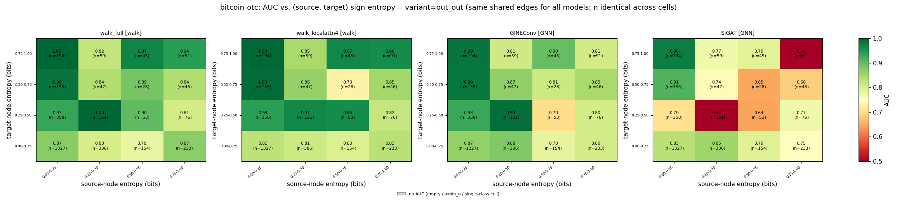

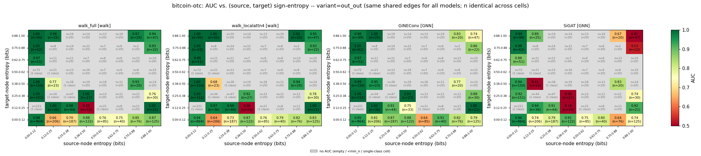

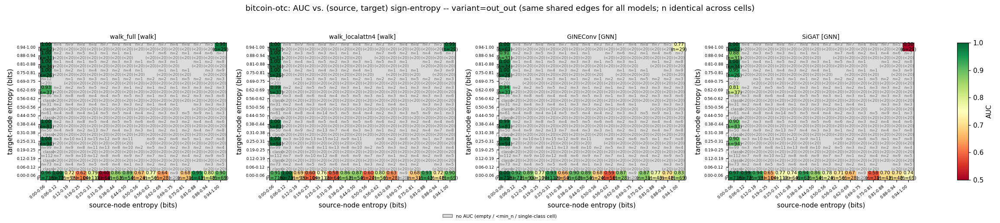

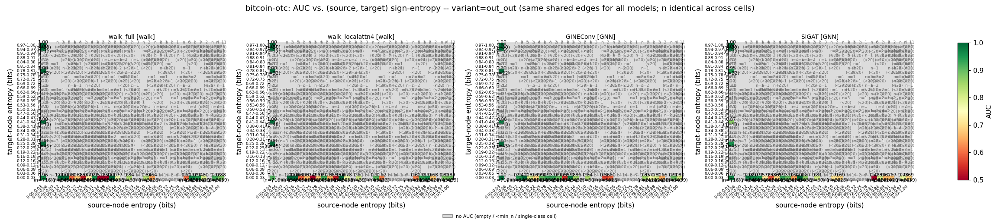

**variant = `out_out`**

| model | low-entropy AUC (n) | high-entropy AUC (n) | drop (low - high) |
|---|---|---|---|
| walk_full | 0.8655 (n=2192) | 0.9169 (n=210) | -0.0514 |
| walk_localattn4 | 0.8530 (n=2192) | 0.9295 (n=210) | -0.0765 |
| GINEConv | 0.8706 (n=2192) | 0.8416 (n=210) | +0.0289 |
| SiGAT | 0.8266 (n=2192) | 0.6832 (n=210) | +0.1433 |

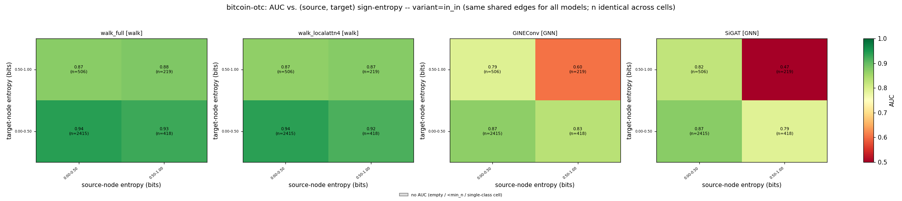

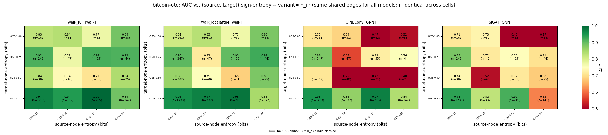

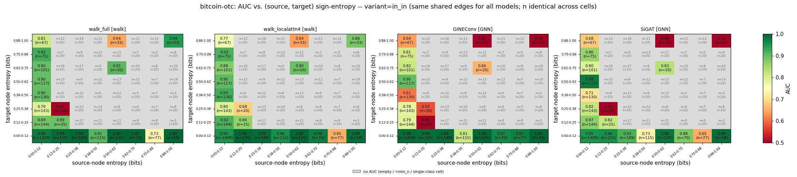

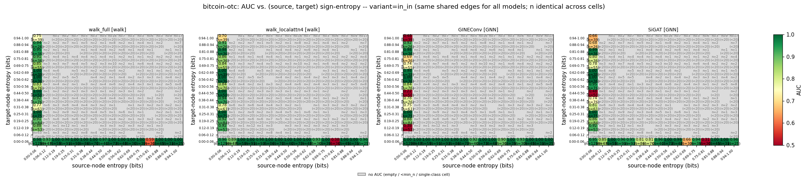

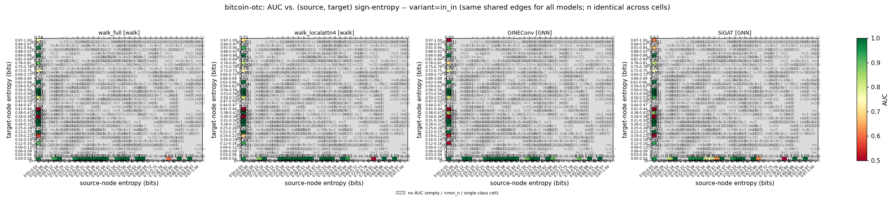

**variant = `in_in`**

| model | low-entropy AUC (n) | high-entropy AUC (n) | drop (low - high) |
|---|---|---|---|
| walk_full | 0.9410 (n=2415) | 0.8804 (n=219) | +0.0606 |
| walk_localattn4 | 0.9394 (n=2415) | 0.8745 (n=219) | +0.0650 |
| GINEConv | 0.8678 (n=2415) | 0.6044 (n=219) | +0.2634 |
| SiGAT | 0.8713 (n=2415) | 0.4707 (n=219) | +0.4006 |

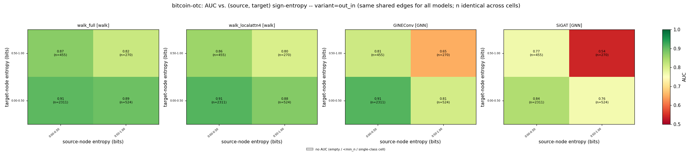

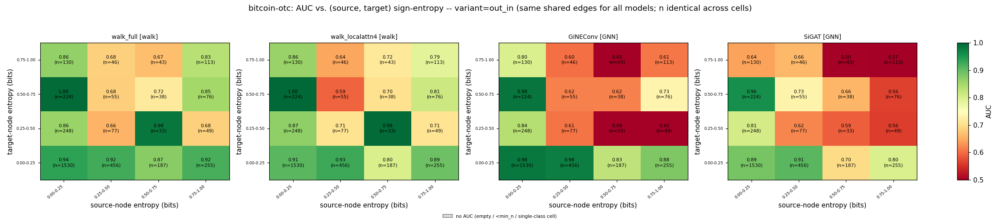

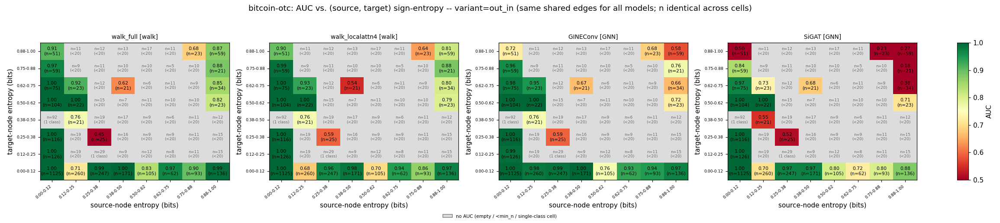

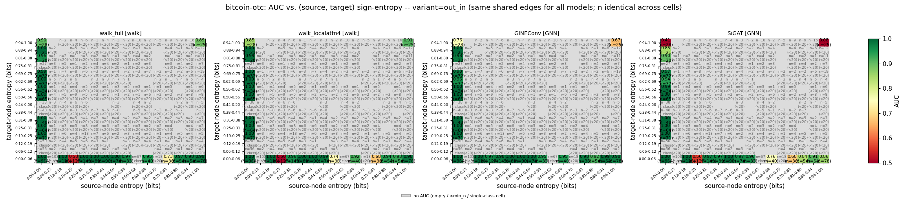

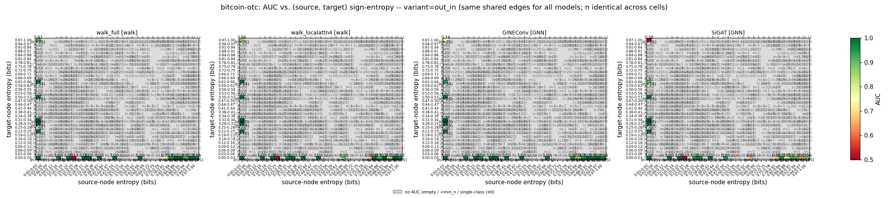

**variant = `out_in`**

| model | low-entropy AUC (n) | high-entropy AUC (n) | drop (low - high) |
|---|---|---|---|
| walk_full | 0.9052 (n=2311) | 0.8151 (n=270) | +0.0901 |
| walk_localattn4 | 0.9107 (n=2311) | 0.7996 (n=270) | +0.1111 |
| GINEConv | 0.9114 (n=2311) | 0.6511 (n=270) | +0.2604 |
| SiGAT | 0.8388 (n=2311) | 0.5406 (n=270) | +0.2982 |

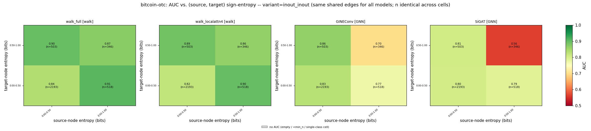

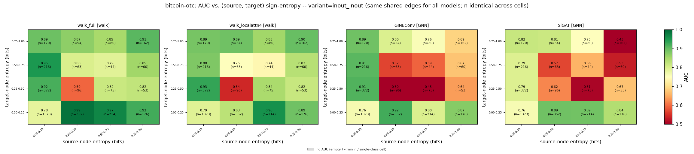

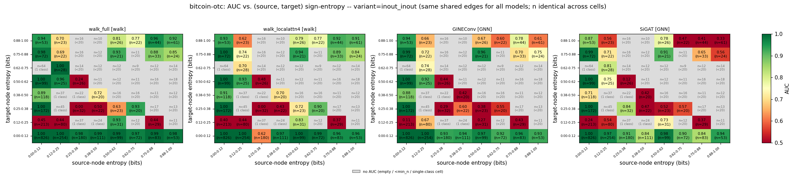

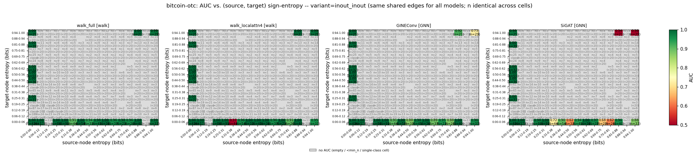

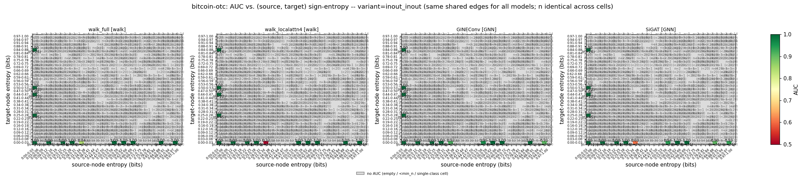

**variant = `inout_inout`**

| model | low-entropy AUC (n) | high-entropy AUC (n) | drop (low - high) |
|---|---|---|---|
| walk_full | 0.8393 (n=2193) | 0.8718 (n=346) | -0.0325 |
| walk_localattn4 | 0.8224 (n=2193) | 0.8648 (n=346) | -0.0424 |
| GINEConv | 0.8330 (n=2193) | 0.6990 (n=346) | +0.1340 |
| SiGAT | 0.8048 (n=2193) | 0.5636 (n=346) | +0.2412 |

### epinions

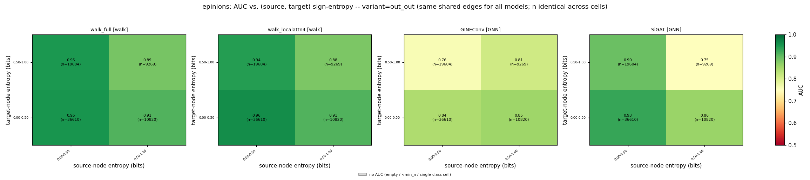

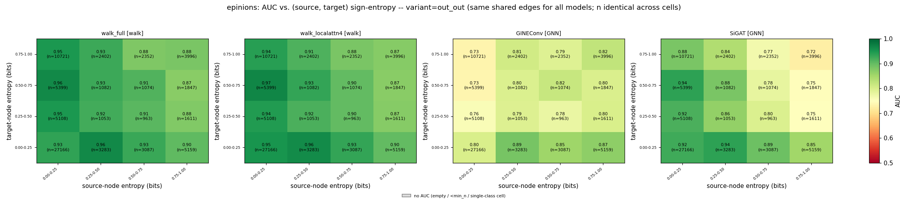

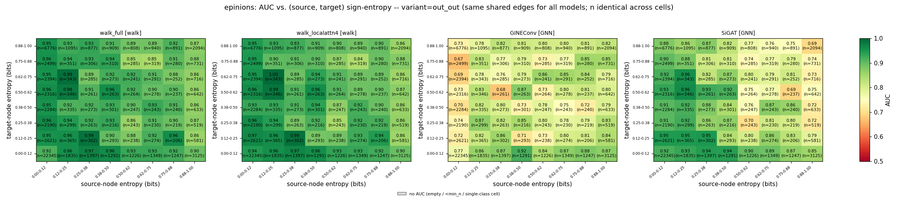

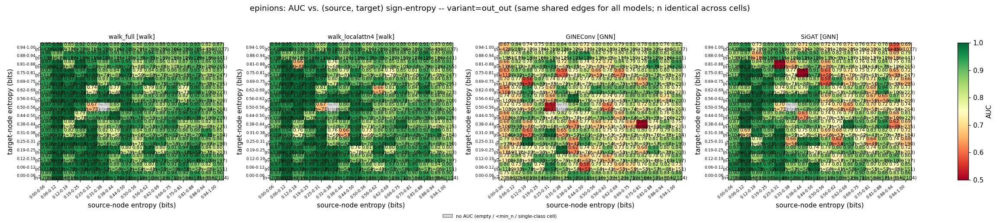

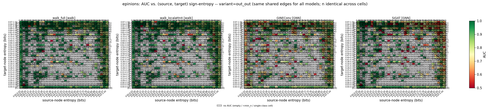

**variant = `out_out`**

| model | low-entropy AUC (n) | high-entropy AUC (n) | drop (low - high) |
|---|---|---|---|
| walk_full | 0.9522 (n=36610) | 0.8856 (n=9269) | +0.0666 |
| walk_localattn4 | 0.9594 (n=36610) | 0.8823 (n=9269) | +0.0771 |
| GINEConv | 0.8405 (n=36610) | 0.8095 (n=9269) | +0.0310 |
| SiGAT | 0.9309 (n=36610) | 0.7504 (n=9269) | +0.1804 |

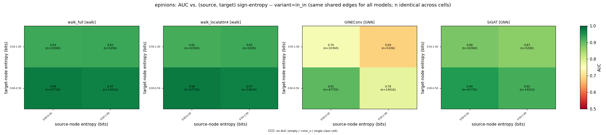

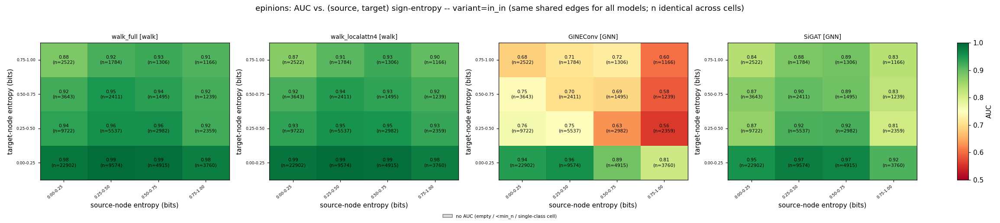

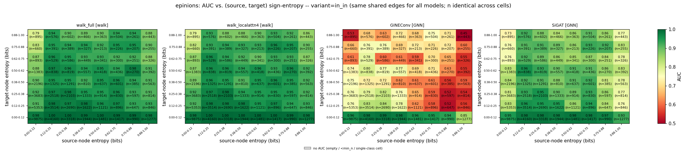

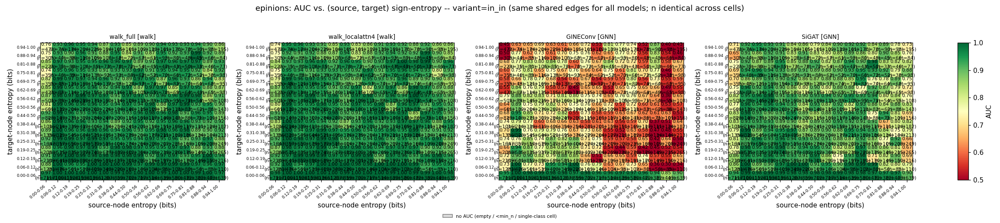

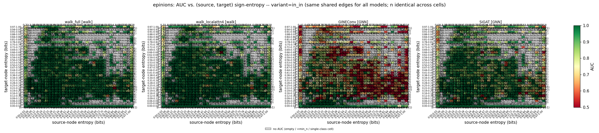

**variant = `in_in`**

| model | low-entropy AUC (n) | high-entropy AUC (n) | drop (low - high) |
|---|---|---|---|
| walk_full | 0.9785 (n=47735) | 0.9294 (n=5206) | +0.0490 |
| walk_localattn4 | 0.9788 (n=47735) | 0.9259 (n=5206) | +0.0529 |
| GINEConv | 0.9054 (n=47735) | 0.6871 (n=5206) | +0.2183 |
| SiGAT | 0.9439 (n=47735) | 0.8694 (n=5206) | +0.0745 |


**variant = `out_in`**

| model | low-entropy AUC (n) | high-entropy AUC (n) | drop (low - high) |
|---|---|---|---|
| walk_full | 0.9654 (n=50222) | 0.8393 (n=6318) | +0.1261 |
| walk_localattn4 | 0.9676 (n=50222) | 0.8360 (n=6318) | +0.1316 |
| GINEConv | 0.8448 (n=50222) | 0.7413 (n=6318) | +0.1034 |
| SiGAT | 0.9330 (n=50222) | 0.7561 (n=6318) | +0.1768 |


**variant = `inout_inout`**

| model | low-entropy AUC (n) | high-entropy AUC (n) | drop (low - high) |
|---|---|---|---|
| walk_full | 0.9445 (n=41465) | 0.9092 (n=11888) | +0.0352 |
| walk_localattn4 | 0.9502 (n=41465) | 0.9072 (n=11888) | +0.0430 |
| GINEConv | 0.8223 (n=41465) | 0.8175 (n=11888) | +0.0048 |
| SiGAT | 0.9065 (n=41465) | 0.8294 (n=11888) | +0.0771 |

### wiki-elec


**variant = `out_out`**

| model | low-entropy AUC (n) | high-entropy AUC (n) | drop (low - high) |
|---|---|---|---|
| walk_full | 0.9273 (n=1089) | 0.8549 (n=2784) | +0.0724 |
| walk_localattn4 | 0.9326 (n=1089) | 0.8534 (n=2784) | +0.0792 |
| GINEConv | 0.8524 (n=1089) | 0.8503 (n=2784) | +0.0021 |
| SiGAT | 0.9000 (n=1089) | 0.8432 (n=2784) | +0.0568 |


**variant = `in_in`**

| model | low-entropy AUC (n) | high-entropy AUC (n) | drop (low - high) |
|---|---|---|---|
| walk_full | 0.9593 (n=2092) | 0.8177 (n=1094) | +0.1415 |
| walk_localattn4 | 0.9599 (n=2092) | 0.8028 (n=1094) | +0.1571 |
| GINEConv | 0.9304 (n=2092) | 0.7030 (n=1094) | +0.2274 |
| SiGAT | 0.9423 (n=2092) | 0.7757 (n=1094) | +0.1666 |


**variant = `out_in`**

| model | low-entropy AUC (n) | high-entropy AUC (n) | drop (low - high) |
|---|---|---|---|
| walk_full | 0.9418 (n=2232) | 0.7410 (n=3286) | +0.2008 |
| walk_localattn4 | 0.9390 (n=2232) | 0.7423 (n=3286) | +0.1967 |
| GINEConv | 0.8919 (n=2232) | 0.7196 (n=3286) | +0.1722 |
| SiGAT | 0.9434 (n=2232) | 0.7296 (n=3286) | +0.2138 |


**variant = `inout_inout`**

| model | low-entropy AUC (n) | high-entropy AUC (n) | drop (low - high) |
|---|---|---|---|
| walk_full | 0.9467 (n=1918) | 0.8009 (n=3952) | +0.1458 |
| walk_localattn4 | 0.9543 (n=1918) | 0.8025 (n=3952) | +0.1518 |
| GINEConv | 0.9121 (n=1918) | 0.7775 (n=3952) | +0.1346 |
| SiGAT | 0.9299 (n=1918) | 0.7856 (n=3952) | +0.1443 |

### wiki-rfa


**variant = `out_out`**

| model | low-entropy AUC (n) | high-entropy AUC (n) | drop (low - high) |
|---|---|---|---|
| walk_full | 0.9199 (n=2183) | 0.8362 (n=6320) | +0.0837 |
| walk_localattn4 | 0.9270 (n=2183) | 0.8353 (n=6320) | +0.0917 |
| GINEConv | 0.8859 (n=2183) | 0.8406 (n=6320) | +0.0453 |
| SiGAT | 0.9119 (n=2183) | 0.8185 (n=6320) | +0.0934 |


**variant = `in_in`**

| model | low-entropy AUC (n) | high-entropy AUC (n) | drop (low - high) |
|---|---|---|---|
| walk_full | 0.9702 (n=3591) | 0.7932 (n=2385) | +0.1770 |
| walk_localattn4 | 0.9664 (n=3591) | 0.7888 (n=2385) | +0.1776 |
| GINEConv | 0.9341 (n=3591) | 0.7419 (n=2385) | +0.1922 |
| SiGAT | 0.9600 (n=3591) | 0.7706 (n=2385) | +0.1894 |


**variant = `out_in`**

| model | low-entropy AUC (n) | high-entropy AUC (n) | drop (low - high) |
|---|---|---|---|
| walk_full | 0.9663 (n=3497) | 0.7389 (n=6098) | +0.2274 |
| walk_localattn4 | 0.9672 (n=3497) | 0.7325 (n=6098) | +0.2347 |
| GINEConv | 0.8969 (n=3497) | 0.7336 (n=6098) | +0.1632 |
| SiGAT | 0.9547 (n=3497) | 0.7276 (n=6098) | +0.2271 |


**variant = `inout_inout`**

| model | low-entropy AUC (n) | high-entropy AUC (n) | drop (low - high) |
|---|---|---|---|
| walk_full | 0.9769 (n=2861) | 0.8005 (n=7348) | +0.1764 |
| walk_localattn4 | 0.9777 (n=2861) | 0.7950 (n=7348) | +0.1828 |
| GINEConv | 0.9132 (n=2861) | 0.7882 (n=7348) | +0.1250 |
| SiGAT | 0.9728 (n=2861) | 0.7781 (n=7348) | +0.1947 |

### slashdot090221


**variant = `out_out`**

| model | low-entropy AUC (n) | high-entropy AUC (n) | drop (low - high) |
|---|---|---|---|
| walk_full | 0.9572 (n=14534) | 0.7498 (n=6884) | +0.2074 |
| walk_localattn4 | 0.9534 (n=14534) | 0.7445 (n=6884) | +0.2089 |
| GINEConv | 0.8398 (n=14534) | 0.7033 (n=6884) | +0.1365 |
| SiGAT | 0.9221 (n=14534) | 0.6766 (n=6884) | +0.2455 |


**variant = `in_in`**

| model | low-entropy AUC (n) | high-entropy AUC (n) | drop (low - high) |
|---|---|---|---|
| walk_full | 0.9469 (n=12462) | 0.8391 (n=17325) | +0.1078 |
| walk_localattn4 | 0.9335 (n=12462) | 0.8351 (n=17325) | +0.0984 |
| GINEConv | 0.8416 (n=12462) | 0.6052 (n=17325) | +0.2364 |
| SiGAT | 0.8938 (n=12462) | 0.7836 (n=17325) | +0.1102 |


**variant = `out_in`**

| model | low-entropy AUC (n) | high-entropy AUC (n) | drop (low - high) |
|---|---|---|---|
| walk_full | 0.9688 (n=15606) | 0.6985 (n=15950) | +0.2703 |
| walk_localattn4 | 0.9556 (n=15606) | 0.6948 (n=15950) | +0.2608 |
| GINEConv | 0.8588 (n=15606) | 0.6206 (n=15950) | +0.2382 |
| SiGAT | 0.9283 (n=15606) | 0.6640 (n=15950) | +0.2643 |


**variant = `inout_inout`**

| model | low-entropy AUC (n) | high-entropy AUC (n) | drop (low - high) |
|---|---|---|---|
| walk_full | 0.9629 (n=13665) | 0.7646 (n=18825) | +0.1982 |
| walk_localattn4 | 0.9508 (n=13665) | 0.7601 (n=18825) | +0.1907 |
| GINEConv | 0.8739 (n=13665) | 0.6106 (n=18825) | +0.2633 |
| SiGAT | 0.9128 (n=13665) | 0.7018 (n=18825) | +0.2109 |

### Combined (all datasets)


